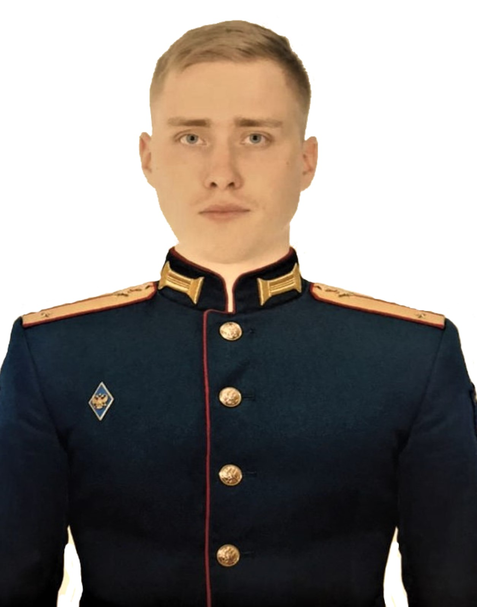

### Разумов Александр

- #### Java - разработчик

- #### Управление подразделениями

- #### Инженер-связист

###### Sankt-Peterburg 🌍 +7(900)655-85-66 📱

###### [Github.com 💼](https://github.com/Razum4e) Razum.ya@ya.ru 📧 [Vk.com 🌐](https://vk.com/id.razum)

<!-- Фото -->

<!-- Таблица -->
<table style="border-collapse: collapse; width: 100%; height: 111px;" border="1">
<tbody>
<tr style="height: 55px;">
<td style="width: 27.5828%; text-align: center; height: 55px;">
<h3>Образование</h3>
</td>
<td style="width: 72.4172%; height: 55px;">

<a href="https://vas.mil.ru/">Военная академия связи</a> им. С. М. Буденного г. Санкт-Петербург, Россия, 2016 - 2021 гг., Высшее образование (специалитет)

Инфокоммуникационные технологии и системы специальной связи, Инженер

Образовательная платформа "<a href="https://netology.ru/">Нетология</a>" 2021-2022 гг., Дополнительное образование

Java-разработчик

</td>
</tr>
<tr style="height: 46px;">
<td style="width: 27.5828%; height: 46px;">
<h3 style="text-align: center;">Работа</h3>
</td>
<td style="width: 72.4172%; height: 46px;">

Военнослужащий по контракту ВВС ПВО Балт. Флота, Июнь 2021 - н.в.

Инженер-связист, Заместитель командира роты связи

</td>
</tr>
<tr>
<td style="width: 27.5828%;">
<h3 style="text-align: center;">Навыки</h3>
</td>
<td style="width: 72.4172%;">
<ul>
<li>Основы Java</li>
<li>IDEA</li>
<li>Основы ООП</li>
<li>Java-коллекции</li>
<li>Git</li>
<li>Основы алгоритмов</li>
<li>Java Core</li>
<li>Maven/Gradle</li>
<li>CSV, XML, JSON</li>
<li>Unit-тесты, Mockito</li>
<li>OSI, TCP, UDP, HTTP</li>
<li>JVM</li>
<li>Pattern</li>
<li>Magics, DRY, SOLID</li>
<li>Основы Adobe Photoshop</li>
</ul>

<ul>
<li>Основы построения инф. систем и сетей</li>
<li>Тех. обеспечение связи и автоматизации</li>
<li>Защита инф. сетей</li>
<li>Основы криптографической защиты информации</li>
<li>Сети связи и системы коммутации</li>
<li>Управление подразделениями</li>
<li>Работа на средствах связи</li>
</ul>
</td>
</tr>
<tr>
<td style="width: 27.5828%;">
<h3 style="text-align: center;">Качества</h3>
</td>
<td style="width: 72.4172%;">
<ul>
<li>Ответственность</li>
<li>Стрессоустойчивость</li>
<li>Коммуникабельность</li>
<li>Упорство</li>
<li>Умение работать в команде</li>
<li>Аналитический склад ума</li>
</ul>
</td>
</tr>
<tr>
<td style="width: 27.5828%;">
<h3 style="text-align: center;">Интересы</h3>
</td>
<td style="width: 72.4172%;">
<ul>
<li>Профессиональные интересы по связи</li>
<li>Frontend/Backend разработка</li>
<li>Семья</li>
<li>Автомобильное дело</li>
<li>Спорт</li>
</ul>
</td>
</tr>
<tr>
<td style="width: 27.5828%;">
<h3 style="text-align: center;">Цели</h3>
</td>
<td style="width: 72.4172%;">
<ul>
<li>Достичь уровня Java Senior Developer</li>
</ul>
</td>
</tr>
</tbody>
</table>

&nbsp;

